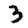
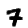
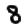

# Handwritten image recognition

This neural network recognizes handwritten digits from a 28x28 pixels image.

```sh
./digit say -in path/to/image-28x28.data -w path/to/weights.json -b path/to/biases.json
```

Images should be the matrix of intensities (0-255).
[https://github.com/wdalmut/mnist-handwritten-digits](https://github.com/wdalmut/mnist-handwritten-digits)

The network's accuracy is about 96% (using `bias.json` and `weights.json`)

## Image conversion

A simple tool that convert an input PNG image in a raw picture composed only by
intensities of the grayscale

Input images should be 28x28 pixels

```sh
./digit convert -in 7.png -o 7.data
```

### Example of png

A simple handwritten digit

 * 
 * 
 * 

## Install

just install dependencies

```
$ go get ./...
$ go run main.go say -w weights.json -b biases.json -i fig/3.data
```

